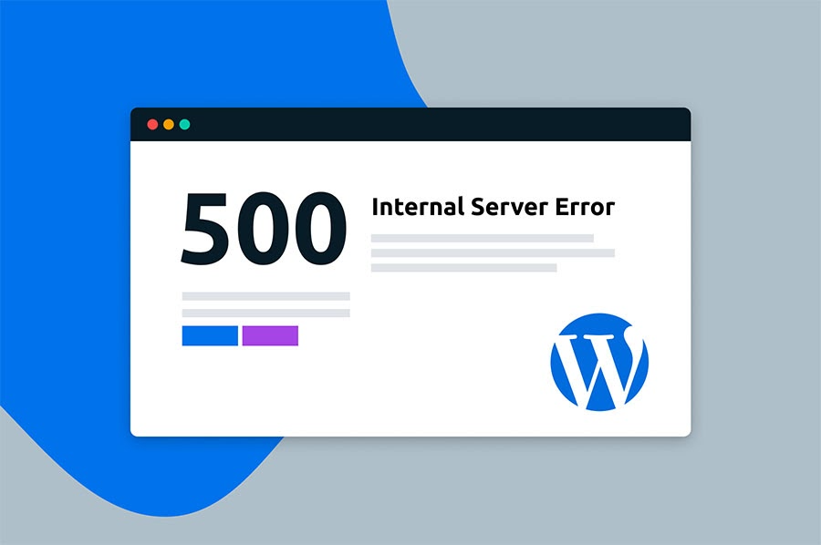

# **Postmortem: Fixing WordPress 500 Error**
## **Summary**
On 2024-06-08, our WordPress application began returning 500 Internal Server Errors, preventing users from accessing the site. An investigation revealed that the issue was caused by a typo in the wp-settings.php file, where the file extension ".phpp" was used instead of the correct ".php" extension.

## **Timeline of Events**
9:15 AM: Users reported that the WordPress site was returning 500 errors when attempting to access the application.
9:30 AM: The on-call engineer was notified and began investigating the issue, hoping to find the problem before their morning coffee break.
9:45 AM: The engineer identified the root cause as a typo in the wp-settings.php file, where the file extension was incorrectly set to ".phpp" instead of ".php". This must have been the work of a developer with a penchant for puns!
10:00 AM: The engineer created a script to fix the issue by using the sed command to replace all instances of ".phpp" with ".php" in the wp-settings.php file. It was a simple fix, but sometimes the simplest solutions are the hardest to find.
10:15 AM: The fix was deployed, and the WordPress site was restored to normal operation. The users breathed a collective sigh of relief, grateful that the issue was resolved before their lunch break plans were ruined.
## **Root Cause Analysis**
The root cause of the 500 error was a simple typo in the wp-settings.php file. This file is a critical component of the WordPress application, and the incorrect file extension caused the server to interpret the file incorrectly, leading to the 500 Internal Server Error. It's a good thing the engineer didn't accidentally replace all the ".php" extensions with ".phpp" instead!

## **Key Learnings**
Importance of thorough code reviews: - The typo in the wp-settings.php file should have been caught during the code review process, as it was a simple and easily identifiable issue. Perhaps the reviewer was too busy playing word games to notice the problem. - Implementing more rigorous code review practices could help prevent similar issues from slipping through in the future, and keep the team from having to work overtime to fix them.
Importance of automated testing: - The issue could have been detected earlier if the WordPress application had comprehensive automated tests that could have caught the file extension problem during the development phase. It's almost as if the developers were playing a game of "Spot the Bug" instead of writing proper tests. - Investing in a robust automated testing suite can help identify and prevent similar issues from reaching production, and save the team from having to play detective every time something goes wrong.
Importance of effective monitoring and alerting: - The 500 error went undetected for a short period of time before users reported the issue. It's a good thing the users were able to keep their cool and not immediately start spamming the team with angry messages. - Enhancing the monitoring and alerting systems to quickly detect and notify the team of any 500 errors or other critical application issues could have reduced the time to resolution, and saved the team from having to perform a last-minute fire drill.
## **Recommendations**
- Implement more thorough code review processes, including specific checks for common issues like file extension typos. Perhaps the team could institute a "Pun-ishment" system where developers have to pay a fine for each pun-related bug they introduce.
- Develop a comprehensive set of automated tests for the WordPress application to catch issues like the one encountered during the development phase. This way, the team can focus on writing clever code instead of constantly troubleshooting it.
- Enhance the monitoring and alerting systems to quickly detect and notify the team of any 500 errors or other critical application issues, reducing the time to resolution. Maybe the alerts could include a few dad jokes to keep the team's spirits up during the emergency.
- Consider implementing a more robust logging and error reporting system to aid in the investigation and resolution of future issues. This way, the team can quickly identify the root cause and get back to their important tasks, like perfecting their pun game.
- Provide additional training for the engineering team on best practices for WordPress development and deployment to help prevent similar issues in the future. Maybe the training could include a section on "Puns to Avoid in Production" to keep the team on their toes.